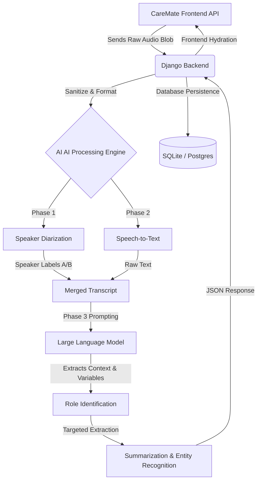

# CareMate: AI-Driven Alzheimer's Audio Processing Pipeline
### Comprehensive Architecture & Workflow Document (Thesis Reference)

This document outlines the end-to-end working of the CareMate intelligent audio processing system. It breaks down the application into two distinct realities: the **Conceptual / User Perspective** (how it impacts humans) and the **Technical / Architectural Perspective** (how the code and AI models interact).

---

## 1. The "Normal Side" (Conceptual Overview & User Journey)

### The Problem Core
Caregivers of Alzheimer's patients often face communication fatigue. Patients may speak in fragmented sentences, repeat questions, mix up names, or struggle to articulate their physical and emotional needs. The caregiver is forced to constantly interpret and guess what the patient requires, leading to burnout. 

### The CareMate Solution
CareMate acts as an intelligent "third ear" in the room. It listens to a complex, emotionally taxing, and structurally messy conversation, and distills it into a clean, actionable checklist of what the patient specifically needs *right now*.

### The User Journey
1. **The Capture:** A caregiver sits down with the patient. They open the CareMate application (which features a premium, calming Aurora Bento UI) and tap "Record".
2. **The Conversation:** They have a normal, unstructured conversation. The patient might express confusion about the time, ask for an old friend, and complain about being too hot.
3. **The Processing (Invisible to User):** The caregiver ends the recording. CareMate silently processes the audio in the cloud.
4. **The Result:** Within seconds, the caregiver’s dashboard receives a structured alert. Instead of listening to a 10-minute recording, they see:
   * **🚨 Need:** Patient feels hot; wants a fan.
   * **🧠 Confusion:** Patient is looking for "Sarah" (a childhood friend).
   * **✅ Action:** Reassure patient about Sarah, adjust room temperature.

---

## 2. The "Technical Side" (System Architecture)

The system relies on a multi-tier architecture connecting a modern web frontend with a Python/Django backend, hooked into external Machine Learning APIs.

### The Stack:
* **Frontend:** HTML5, modern CSS (Aurora Bento UI design system, Framer Motion for liquid/spring animations), Javascript for client-side audio capture.
* **Backend:** Django (Python), SQLite/PostgreSQL, WhiteNoise (for static routing on platforms like Render).
* **AI Engine Layer:** Cloud-based inference models for Diarization (e.g., AssemblyAI or Pyannote), Speech-to-Text (e.g., Whisper), and Large Language Models (LLM - e.g., Gemini Pro or GPT-4).

### System Architecture Diagram



---

## 3. Micro-Details: The 5-Phase Audio Pipeline

Here is the exact, step-by-step technological workflow of how a raw sound wave is converted into actionable medical/caregiver insights.

### Phase 1: Audio Capture & Preprocessing
When the caregiver clicks "record" via the frontend UI, the browser utilizes the `MediaRecorder API` to capture the audio stream. 
* **Micro-detail:** The frontend converts the audio stream into a compressed format (like `.mp3` or `.webm`) to reduce payload size. 
* **Security:** The blob is transmitted securely via HTTPS `POST` request to the Django backend. The backend validates the mime-type and checks file size limits before passing it to the processing queue.

### Phase 2: Speaker Diarization (The "Who")
Diarization is the process of partitioning an audio stream into homogeneous segments according to the speaker's identity. 
* **Micro-detail:** The algorithm converts the raw audio into MFCCs (Mel-Frequency Cepstral Coefficients) to extract acoustic features.
* **Clustering:** It then uses a clustering algorithm (like Gaussian Mixture Models - GMMs) to group identical voice signatures together. It outputs a timeline: `[00:00 - 00:05] Speaker A, [00:05 - 00:12] Speaker B`. 

### Phase 3: Speech-to-Text / STT (The "What")
Simultaneously, an Automatic Speech Recognition (ASR) model transcribes the words. 
* **Micro-detail:** The system merges the Diarization timeline with the STT timeline to create a perfect script:
  > `"Speaker A": "I need my blue pills."`
  > `"Speaker B": "Okay, let's get them."`

### Phase 4: Role Identification (The "Context")
The merged script is fed into a Large Language Model (LLM) via an API constraint. 
* **Prompt Engineering:** The LLM is given a system prompt establishing its persona: *"You are an expert gerontology analyzer. Analyze this log."*
* **Inference:** The LLM uses semantic analysis to detect hierarchical tone. It identifies that the speaker asking guiding questions or providing reassurance (Speaker B) is the **Caregiver**, while the speaker exhibiting repetitive questioning, confusion, or expressing base needs (Speaker A) is the **Patient**.

### Phase 5: NLP Feature Extraction Strategy (The "Value")
Once the patient is identified, the LLM maps *only* the patient's dialogue against a predefined schema. 
* **Micro-detail:** The backend strictly requests a `JSON` response from the LLM to ensure the data can be parsed easily by Django.
* **Data Schema:** The LLM is forced to return data structured as:
  ```json
  {
    "physical_needs": ["blue pills", "water"],
    "emotional_state": "anxious, disoriented regarding time",
    "memory_trigger_points": ["Looking for deceased husband"]
  }
  ```
The Django backend catches this JSON, maps it to the internal Database models (e.g., a `MemoryLog` or `PatientNeed` Django model), saves it, and pushes the clean data back to the frontend's Aurora Bento dashboard.

---

## 4. Addressing Edge Cases & Complexities

For an academic thesis, it is critical to acknowledge system limitations and how they are handled programmatically.

1. **Overlapping Speech (Cross-talk):** 
   * *Problem:* Alzheimer's patients often interrupt or speak simultaneously with the caregiver.
   * *Technical Solution:* Modern VAD (Voice Activity Detection) models split overlapping audio tracks into separate channels before STT processing, ensuring both voices are transcribed independently.
2. **Hallucinations by the LLM:** 
   * *Problem:* The summarizing AI might "invent" a need that wasn't actually spoken.
   * *Technical Solution:* Implementing "Temperature constraint" (`temperature = 0.0` or `0.1` in the LLM API settings) forces the model to be purely deterministic and extractive, heavily reducing creative hallucination.
3. **Audio Background Noise:** 
   * *Problem:* TVs or hospital machinery in the background.
   * *Technical Solution:* Applying a noise-gate filter before Step 2.

--- 
*End of Document. Suitable for structural integration into thesis methodologies.*
